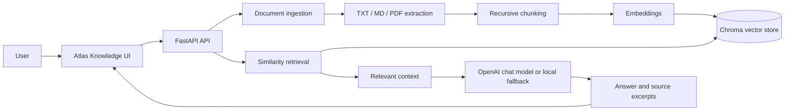

# Atlas Knowledge

### A grounded RAG assistant for enterprise documents

Atlas Knowledge turns scattered company documents into a searchable question-and-answer workspace. Users upload policies, handbooks, technical guides, and PDFs, then ask questions in natural language and receive answers grounded in the indexed content.

It demonstrates the engineering foundations behind useful enterprise GenAI products: document ingestion, chunking, embeddings, vector retrieval, grounded responses, source transparency, and a clean API-first workflow.

## Why It Matters

Employees often spend time searching through hundreds of pages to answer one question. Atlas Knowledge reduces that friction:

```text
Documents -> text extraction -> chunking -> embeddings -> Chroma
                                                        |
Question -> query embedding -> similarity search -> relevant context
                                                        |
                                      grounded answer + sources
```

The assistant is designed to avoid inventing an answer when the uploaded documents do not contain relevant information.

## Product Highlights

- Upload `.txt`, `.md`, and `.pdf` documents from the browser.
- Split source material into configurable retrieval chunks.
- Persist vectors locally with Chroma for repeatable development.
- Use OpenAI embeddings and chat generation when an API key is configured.
- Run offline with deterministic local embeddings and concise extractive answers.
- Reject unrelated questions instead of returning arbitrary nearest-neighbor content.
- Display source excerpts and relevance scores for answer inspection.
- List indexed documents and delete them from the knowledge base.
- Use the FastAPI OpenAPI documentation for API exploration.
- Keep the interface responsive, lightweight, and usable on mobile screens.

## Architecture



## Technology Stack

| Layer | Technology |
| --- | --- |
| Backend | Python, FastAPI, Uvicorn |
| RAG orchestration | LangChain |
| Vector store | Chroma |
| Production embeddings and generation | OpenAI-compatible models |
| Offline development mode | Deterministic local embeddings and extractive fallback |
| Document processing | `pypdf`, LangChain text splitters |
| Frontend | Semantic HTML, CSS, and browser JavaScript |
| Quality | Pytest and Ruff |

## Quick Start

### 1. Create the environment

```powershell
py -m venv .venv
.\.venv\Scripts\Activate.ps1
python -m pip install -e ".[dev]"
```

### 2. Configure optional LLM access

```powershell
Copy-Item .env.example .env
```

Add `OPENAI_API_KEY` to `.env` to enable LLM-generated answers. Without a key, Atlas Knowledge remains usable in local development with deterministic embeddings and an extractive response fallback.

### 3. Start the application

```powershell
uvicorn app.main:app --reload
```

Open:

- Web app: http://127.0.0.1:8000/
- Interactive API docs: http://127.0.0.1:8000/docs
- Health check: http://127.0.0.1:8000/health

## API Examples

### Upload a document

```powershell
curl.exe -X POST http://127.0.0.1:8000/documents `
  -F "file=@handbook.md"
```

### Ask a question

```powershell
curl.exe -X POST http://127.0.0.1:8000/query `
  -H "Content-Type: application/json" `
  -d '{"question":"What is our remote work policy?"}'
```

Example response shape:

```json
{
  "answer": "...",
  "sources": [
    {
      "source": "handbook.md",
      "excerpt": "...",
      "score": 0.82
    }
  ]
}
```

### Manage indexed documents

```powershell
curl.exe http://127.0.0.1:8000/documents
curl.exe -X DELETE http://127.0.0.1:8000/documents/handbook.md
```

## Configuration

Environment variables are loaded from `.env`:

| Variable | Default | Purpose |
| --- | --- | --- |
| `OPENAI_API_KEY` | empty | Enables OpenAI embeddings and chat answers |
| `OPENAI_CHAT_MODEL` | `gpt-4o-mini` | Chat model name |
| `OPENAI_EMBEDDING_MODEL` | `text-embedding-3-small` | Embedding model name |
| `CHROMA_PERSIST_DIRECTORY` | `./data/chroma` | Local vector-store directory |
| `RETRIEVAL_K` | `4` | Number of chunks retrieved per question |
| `CHUNK_SIZE` | `900` | Maximum chunk size |
| `CHUNK_OVERLAP` | `150` | Overlap between neighboring chunks |

## Engineering Decisions

- **Grounding first:** the LLM receives retrieved context and is instructed to answer only from that context.
- **Graceful local development:** the project works without paid API credentials, making setup and testing accessible.
- **Inspectable answers:** every response includes source excerpts and retrieval scores instead of hiding the retrieval step.
- **Small service boundary:** FastAPI keeps ingestion, retrieval, and UI integration easy to test and extend.
- **Persistent local state:** Chroma preserves the local knowledge base between application restarts.

## Testing

```powershell
pytest
ruff check .
```

The test suite covers document decoding, unsupported file handling, deterministic embeddings, indexing and retrieval, unrelated-question refusal, and the upload/query/list/delete API workflow.

## Current Scope and Roadmap

This repository is a focused, production-shaped MVP. The next steps for a larger enterprise deployment would be:

- Page-aware PDF citations and document versioning.
- Authentication, role-based access control, and tenant isolation.
- Upload size limits, richer file formats, and background indexing jobs.
- Managed vector storage and object storage.
- Structured logging, metrics, tracing, rate limits, and evaluation datasets.

## Author

**Developed by Jitendra Dewangan**

This project demonstrates practical experience building a complete RAG workflow with Python, FastAPI, LangChain, embeddings, vector search, and a usable web interface.