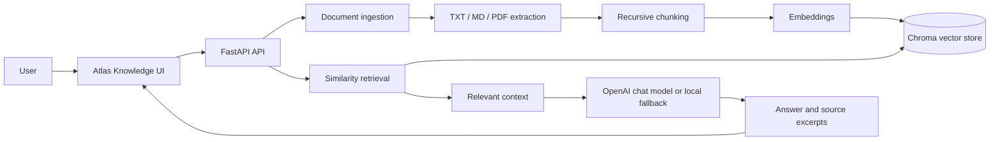

# Atlas Knowledge

### A grounded RAG assistant for enterprise documents

Atlas Knowledge turns scattered company documents into a searchable question-and-answer workspace. Users upload policies, handbooks, technical guides, and PDFs, then ask questions in natural language and receive answers grounded in the indexed content.

It demonstrates the engineering foundations behind useful enterprise GenAI products: document ingestion, chunking, embeddings, vector retrieval, grounded responses, source transparency, and a clean API-first workflow.

## Why It Matters

Employees often spend time searching through hundreds of pages to answer one question. Atlas Knowledge reduces that friction:

```text
Documents -> text extraction -> chunking -> embeddings -> Chroma
                                                        |
Question -> query embedding -> similarity search -> relevant context
                                                        |
                                      grounded answer + sources
```

The assistant is designed to avoid inventing an answer when the uploaded documents do not contain relevant information.

## Product Highlights

- Upload `.txt`, `.md`, and `.pdf` documents from the browser.
- Split source material into configurable retrieval chunks.
- Persist vectors locally with Chroma for repeatable development.
- Use OpenAI embeddings and chat generation when an API key is configured.
- Run offline with deterministic local embeddings and concise extractive answers.
- Reject unrelated questions instead of returning arbitrary nearest-neighbor content.
- Display source excerpts and relevance scores for answer inspection.
- List indexed documents and delete them from the knowledge base.
- Use the FastAPI OpenAPI documentation for API exploration.
- Keep the interface responsive, lightweight, and usable on mobile screens.

## Architecture



## Technology Stack

| Layer | Technology |
| --- | --- |
| Backend | Python, FastAPI, Uvicorn |
| RAG orchestration | LangChain |
| Local vector store | Chroma |
| Production vector schema | PostgreSQL + pgvector repository and Alembic migration |
| Production embeddings and generation | OpenAI-compatible models |
| Offline development mode | Deterministic local embeddings and extractive fallback |
| Document processing | `pypdf`, LangChain text splitters |
| Frontend | Streamlit client plus lightweight browser client |
| Quality | Pytest and Ruff |

## Quick Start

### 1. Create the environment

```powershell
py -m venv .venv
.\.venv\Scripts\Activate.ps1
python -m pip install -e ".[dev]"
```

### 2. Configure optional LLM access

```powershell
Copy-Item .env.example .env
```

Add `OPENAI_API_KEY` to `.env` to enable LLM-generated answers. Without a key, Atlas Knowledge remains usable in local development with deterministic embeddings and an extractive response fallback. Never commit `.env` or paste a key into `.env.example`.

### 3. Start the application

```powershell
uvicorn app.main:app --reload
```

To run the Streamlit client in a second terminal:

```powershell
streamlit run frontend/streamlit_app.py
```

Open:

- Web app: http://127.0.0.1:8000/
- Interactive API docs: http://127.0.0.1:8000/docs
- Health check: http://127.0.0.1:8000/health
- Streamlit client: http://localhost:8501/

## API Examples

### Upload a document

```powershell
curl.exe -X POST http://127.0.0.1:8000/documents `
  -F "file=@handbook.md"
```

### Ask a question

```powershell
curl.exe -X POST http://127.0.0.1:8000/query `
  -H "Content-Type: application/json" `
  -d '{"question":"What is our remote work policy?"}'
```

Example response shape:

```json
{
  "answer": "...",
  "sources": [
    {
      "source": "handbook.md",
      "excerpt": "...",
      "score": 0.82
    }
  ]
}
```

### Manage indexed documents

```powershell
curl.exe http://127.0.0.1:8000/documents
curl.exe -X DELETE http://127.0.0.1:8000/documents/handbook.md
```

### Continue a conversation

```powershell
curl.exe -X POST http://127.0.0.1:8000/chat `
  -H "Content-Type: application/json" `
  -H "X-User-ID: demo-user" `
  -d '{"question":"Summarize that policy."}'
```

The response contains a `conversation_id`. Send it in the next request to preserve bounded multi-turn context. Set `APPLICATION_API_KEY` and send it as `X-API-Key` when API authentication is enabled.

## Configuration

Environment variables are loaded from `.env`:

| Variable | Default | Purpose |
| --- | --- | --- |
| `OPENAI_API_KEY` | empty | Enables OpenAI embeddings and chat answers |
| `OPENAI_CHAT_MODEL` | `gpt-4o-mini` | Chat model name |
| `OPENAI_EMBEDDING_MODEL` | `text-embedding-3-small` | Embedding model name |
| `CHROMA_PERSIST_DIRECTORY` | `./data/chroma` | Local vector-store directory |
| `DATABASE_URL` | local PostgreSQL URL | SQLAlchemy and Alembic database URL |
| `APPLICATION_API_KEY` | empty | Optional shared API credential |
| `CORS_ORIGINS` | local app URLs | Comma-separated allowed browser origins |
| `MAX_UPLOAD_BYTES` | `10000000` | Maximum upload size |
| `RETRIEVAL_SCORE_THRESHOLD` | `0.25` | Minimum retrieval score |
| `LLM_TIMEOUT_SECONDS` | `30` | LLM request timeout |
| `LLM_MAX_RETRIES` | `1` | Maximum provider retries |
| `CONVERSATION_HISTORY_LIMIT` | `10` | Recent messages included in chat context |
| `API_BASE_URL` | `http://127.0.0.1:8000` | FastAPI URL used by Streamlit |
| `RETRIEVAL_K` | `4` | Number of chunks retrieved per question |
| `CHUNK_SIZE` | `900` | Maximum chunk size |
| `CHUNK_OVERLAP` | `150` | Overlap between neighboring chunks |

## Engineering Decisions

- **Grounding first:** the LLM receives retrieved context and is instructed to answer only from that context.
- **Graceful local development:** the project works without paid API credentials, making setup and testing accessible.
- **Inspectable answers:** every response includes source excerpts and retrieval scores instead of hiding the retrieval step.
- **Small service boundary:** FastAPI keeps ingestion, retrieval, and UI integration easy to test and extend.
- **Persistent local state:** Chroma preserves the local knowledge base between application restarts.
- **Defense in depth:** optional API-key checks, safe filenames, upload limits, CORS controls, request IDs, and generic internal-error responses reduce common operational risks.

## Project Structure

```text
app/
├── core/             # Logging, request IDs, and authentication boundary
├── db/               # SQLAlchemy models, sessions, and migrations metadata
├── providers/        # Embedding and grounded-generation providers
├── repositories/     # pgvector retrieval repository
├── services/         # Conversation orchestration
├── ingestion.py      # Validation, extraction, cleaning, and chunk metadata
├── rag.py            # Active Chroma-backed RAG compatibility layer
└── main.py           # FastAPI application and routes
frontend/
├── index.html        # Lightweight browser client
└── streamlit_app.py  # Multi-turn Streamlit client
evaluation/
└── dataset.jsonl     # Small evaluation set template
tests/                # Unit and integration-style tests
```

## Testing

```powershell
pytest
ruff check .
```

The test suite covers document decoding, upload validation, page/chunk metadata, deterministic embeddings, indexing and retrieval, unrelated-question refusal, grounded prompt boundaries, conversation persistence, API authentication, and the upload/query/list/delete/chat workflows.

## Evaluation Methodology

The starter dataset is stored in `evaluation/dataset.jsonl` with a question, expected answer, and expected source. A useful evaluation run should:

1. Load the sample enterprise documents into a clean knowledge base.
2. Run every question through `/query` or `/chat`.
3. Compare returned sources with `expected_source`.
4. Review whether the answer is supported by the returned excerpts.
5. Record retrieval relevance, source correctness, groundedness, and safe refusal for unknown questions.

This repository does not claim an accuracy percentage because a complete benchmark has not been run.

## Docker

With Docker Desktop running, start the complete stack:

```powershell
docker compose up --build
```

This starts PostgreSQL with pgvector, the FastAPI service, and the Streamlit client. FastAPI applies Alembic migrations before serving traffic. Open http://localhost:8501 for the Streamlit client or http://localhost:8000/docs for the API.

## Security Considerations

- Secrets are read from environment variables and `.env` is ignored by Git.
- Uploads validate filename shape, extension, MIME type, size, and extractable content.
- Documents are treated as untrusted input in the grounded prompt.
- Optional API-key enforcement and user identity boundaries are available.
- Request logs record method, path, status, request ID, and latency, not document contents.

The current identity header is an extension point for OAuth/JWT integration, not a complete identity provider. PostgreSQL, managed object storage, tenant isolation, and full role-based authorization are deployment work still required for sensitive enterprise data.

## Limitations and Roadmap

This repository is a focused, production-shaped MVP. The next steps for a larger enterprise deployment would be:

- Connect the pgvector repository to the active ingestion and retrieval path.
- Add document versioning and replace-on-reupload behavior.
- Add richer file formats and background indexing jobs.
- Complete OAuth/JWT authentication, tenant isolation, and role-based authorization.
- Add managed object storage, metrics, tracing, rate limits, and automated evaluation runs.

## Author

**Developed by Jitendra Dewangan**

This project demonstrates practical experience building a complete RAG workflow with Python, FastAPI, LangChain, embeddings, vector search, and a usable web interface.